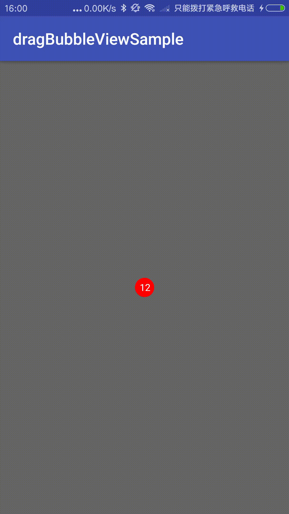

# Android DragBubbleVIew 

# 模仿QQ未读消息

## 效果图



### 使用方法：

Gradle</br>
*1：In the project root directory build.gradle*</br>
```groovy
repositories {
          　　//Rely on the warehouse
        　　　maven { url 'https://jitpack.io' }
        　　}
        }
```
    	


2：*The project directory build.gradle relies on the DashBoard framework*
```groovy
dependencies {
	        implementation 'com.github.trc1993:DragBubbleView:-SNAPSHOT'
	}
```
### 使用方法
在XML中使用

```xml
    <com.tianrongchuang.dragbubble.DragBubbleView
        android:layout_width="wrap_content"
        android:layout_height="wrap_content"
        android:layout_centerInParent="true"
        app:bubble_text="12"
        app:bubble_textColor="#ffffff"
        app:bubble_textSize="12dp"
        app:bubble_radius="12dp"
        app:bubble_color="#ff0000"/>
```
java中使用

```java
  reset()

    //设置 气泡半径
 setmBubbleRadius(float mBubbleRadius) 
 
    //设置 气泡颜色
setmBubbleColor(int mBubbleColor) 

    //设置 气泡消息文字
setmTextStr(String mTextStr)

    //设置 气泡消息文字颜色
 setmTextColor(int mTextColor)
 
    //设置 气泡消息文字大小
setmTextSize(float mTextSize) 

    //设置 不动气泡的半径
setmBubStillRadius(float mBubStillRadius) 

    //设置 可动气泡的半径
setmBubMoveableRadius(float mBubMoveableRadius)

    //设置 气泡爆炸的图片id数组
setmBurstDrawablesArray(int[] mBurstDrawablesArray) 
```
attrs
```xml
<resources>
    <declare-styleable name="DragBubbleView">
        <attr name="bubble_radius" format="dimension"/>
        <attr name="bubble_color" format="color"/>
        <attr name="bubble_text" format="string"/>
        <attr name="bubble_textSize" format="dimension"/>
        <attr name="bubble_textColor" format="color"/>
    </declare-styleable>
</resources>
```
